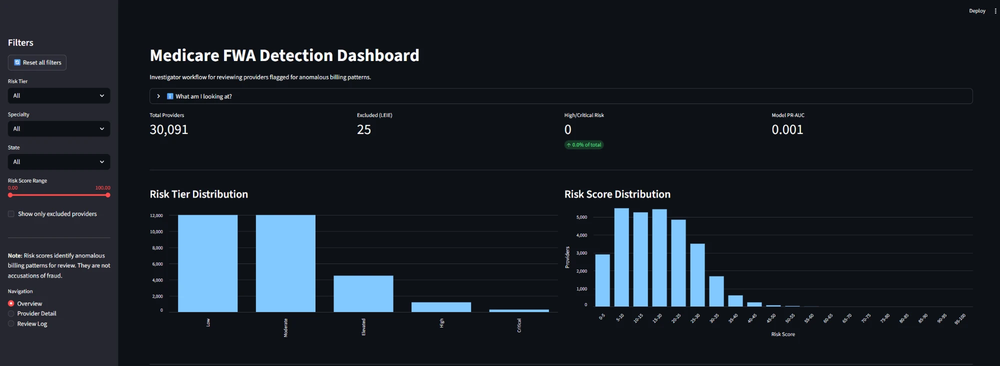
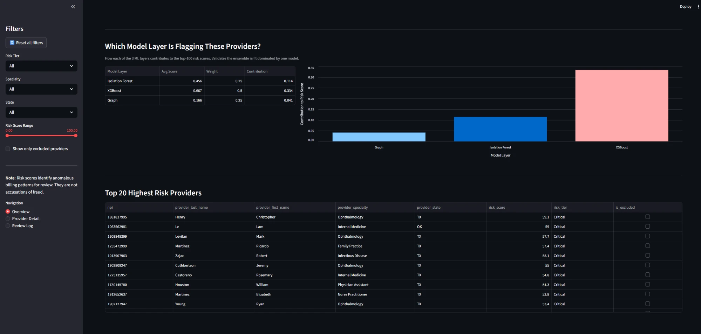

# Medicare Provider FWA Detection System

> **🟢 Live demo:** [med-fraud-systerm-8q2mvujs8rzcbrcw7zpbkc.streamlit.app](https://med-fraud-systerm-8q2mvujs8rzcbrcw7zpbkc.streamlit.app/)
>
> Interactive investigator dashboard powered by the precomputed risk table from this pipeline. No DuckDB or ML runtime dependency at the edge — the app reads `artifacts/risk_table.parquet` (4.5 MB, 30K scored providers).

An end-to-end machine learning system that identifies anomalous billing patterns in Medicare Part B claims data, flagging providers for Fraud, Waste, and Abuse (FWA) review. Built with industrial engineering principles — statistical process control, peer benchmarking, and throughput analysis — applied to healthcare claims data.

> **Portfolio project** targeting AI/ML roles in government healthcare analytics (e.g., CMS Fraud, Waste, and Abuse programs).
> Uses only **publicly available CMS data** — no PHI or PII.

---

## Dashboard


*Overview page: 30K+ providers scored across 5 risk tiers (Low → Critical), with risk score distribution and key metrics including total providers, LEIE-excluded count, and model PR-AUC.*


*Model layer breakdown showing each ensemble component's contribution to the top-100 risk scores, plus the top 20 highest-risk providers ranked by composite score.*

---

## Architecture

```
┌─────────────────────────────────────────────────────────────────────────┐
│                        DATA SOURCES (Public CMS)                        │
│  ┌──────────────┐  ┌──────────────┐  ┌──────────────┐                  │
│  │  Part B       │  │  LEIE         │  │  NPPES NPI   │                  │
│  │  Billing Data │  │  Exclusions   │  │  Registry    │                  │
│  └──────┬───────┘  └──────┬───────┘  └──────┬───────┘                  │
└─────────┼──────────────────┼──────────────────┼─────────────────────────┘
          │                  │                  │
          ▼                  ▼                  ▼
┌─────────────────────────────────────────────────────────────────────────┐
│                     INGESTION LAYER (Dagster)                           │
│  Download → Validate (Great Expectations) → Load to DuckDB raw schema  │
└─────────────────────────────┬───────────────────────────────────────────┘
                              │
                              ▼
┌─────────────────────────────────────────────────────────────────────────┐
│                   TRANSFORMATION LAYER (dbt-duckdb)                     │
│  staging → intermediate (join + enrich) → marts (ML-ready features)    │
└─────────────────────────────┬───────────────────────────────────────────┘
                              │
                              ▼
┌─────────────────────────────────────────────────────────────────────────┐
│              FEATURE ENGINEERING (Industrial Engineering)                │
│                                                                         │
│  ┌─────────────┐ ┌──────────────┐ ┌─────────────┐ ┌────────────────┐  │
│  │ SPC Z-Scores│ │ Peer J-S     │ │ Billing     │ │ Geographic     │  │
│  │ (Control    │ │ Divergence   │ │ Velocity    │ │ Dispersion     │  │
│  │  Charts)    │ │ Benchmarking │ │ (Throughput)│ │ (Entropy)      │  │
│  └─────────────┘ └──────────────┘ └─────────────┘ └────────────────┘  │
│  ┌─────────────┐ ┌──────────────┐ ┌──────────────────────────────────┐│
│  │ Upcoding    │ │ YoY Volume   │ │ Mahalanobis Distance             ││
│  │ Indicators  │ │ Deltas       │ │ (Specialty-Conditional Outliers) ││
│  └─────────────┘ └──────────────┘ └──────────────────────────────────┘│
└─────────────────────────────┬───────────────────────────────────────────┘
                              │
                              ▼
┌─────────────────────────────────────────────────────────────────────────┐
│                    MODELING LAYER (Layered ML)                           │
│                                                                         │
│  Layer 1: Isolation Forest ──┐                                          │
│  Layer 2: XGBoost (LEIE) ────┼──▶ Ensemble Risk Score (0-100)          │
│  Layer 3: Graph/GNN ─────────┘    + SHAP Explanations                  │
│                                                                         │
└──────────┬──────────────────────────────────┬───────────────────────────┘
           │                                  │
           ▼                                  ▼
┌─────────────────────┐          ┌────────────────────────┐
│  FastAPI             │          │  Streamlit Dashboard    │
│  POST /score         │          │  - Provider search      │
│  - Risk score        │          │  - Top-risk browse      │
│  - SHAP contributors │          │  - SHAP drill-down      │
│  - Peer comparison   │          │  - Peer benchmarks      │
└─────────────────────┘          └────────────────────────┘
```

## Key Design Decisions

| Decision | Choice | Why |
|----------|--------|-----|
| **Orchestration** | Dagster | Asset-based model fits data pipelines better than Airflow's task DAGs; excellent local dev experience |
| **Local storage** | DuckDB | Analytical workloads on a laptop without a server; columnar format; SQL interface; schema maps directly to Postgres/Snowflake for production |
| **Transformations** | dbt-duckdb | Version-controlled SQL, built-in testing, lineage graph; industry standard for analytics engineering |
| **Feature design** | IE principles | Statistical process control and peer benchmarking bring domain rigor beyond generic anomaly detection |
| **Explainability** | SHAP | Required for government/regulated use; investigators need to understand *why* a provider was flagged |

## Data Sources

All data is **public and free** — no credentials needed:

| Source | Description | Join Key |
|--------|-------------|----------|
| [CMS Part B by Provider & Service](https://data.cms.gov/provider-summary-by-type-of-service/medicare-physician-other-practitioners/medicare-physician-other-practitioners-by-provider-and-service) | Billing volumes, charges, payments per provider per HCPCS code | NPI |
| [OIG LEIE](https://oig.hhs.gov/exclusions/exclusions_list.asp) | Excluded providers (fraud labels) | NPI |
| [NPPES NPI Registry](https://download.cms.gov/nppes/NPI_Files.html) | Provider specialty, taxonomy, location | NPI |

## Quick Start

```bash
# Clone and set up
git clone https://github.com/YOUR_USERNAME/medicare-fwa-detection.git
cd medicare-fwa-detection
cp .env.example .env

# Install (Python 3.11+ required)
pip install -e ".[dev]"
pre-commit install

# Run the pipeline
make ingest       # Download CMS data (Texas, 2022 by default)
make transform    # Run dbt transformations
make train        # Train ML models

# Launch services
make serve        # FastAPI on :8000
make dashboard    # Streamlit on :8501

# Or use Docker
make docker-up
```

## Project Structure

```
medicare-fwa-detection/
├── src/cms_fwa/              # Main Python package
│   ├── config.py             #   Centralized settings (no hardcoded paths)
│   ├── ingestion/            #   Data download & loading
│   ├── transformations/      #   Python-side transform helpers
│   ├── features/             #   IE-based feature engineering
│   ├── models/               #   ML training & inference
│   ├── serving/              #   FastAPI + Streamlit
│   └── utils/                #   Shared utilities
├── dbt/                      # dbt project (staging → marts)
│   ├── models/
│   │   ├── staging/          #   Clean/cast raw sources
│   │   ├── intermediate/     #   Enriched provider records
│   │   └── marts/            #   ML-ready feature tables
│   ├── macros/
│   └── tests/
├── dagster_project/          # Dagster workspace config (redirects to src/)
├── notebooks/                # Exploratory analysis
├── tests/                    # pytest (unit + integration + data quality)
├── docker/                   # Dockerfiles + docker-compose
├── docs/                     # ADRs, writeup, diagrams
├── data/                     # Local data (gitignored)
│   ├── raw/                  #   Downloaded files
│   ├── processed/            #   Intermediate outputs
│   └── models/               #   Trained model artifacts
├── .github/workflows/        # CI/CD (lint, test, build)
├── pyproject.toml            # Dependencies & tool config
├── Makefile                  # Developer commands
└── .pre-commit-config.yaml   # Code quality hooks
```

## Feature Engineering Highlights

This project applies **industrial engineering** principles to healthcare fraud detection:

- **Statistical Process Control (SPC):** Billing volume z-scores computed against specialty peer groups — the same control chart logic used in manufacturing quality assurance
- **Peer Benchmarking:** Jensen-Shannon divergence of each provider's procedure mix versus their specialty median — quantifies *how different* a provider's billing pattern is
- **Billing Velocity Analysis:** Services-per-beneficiary-per-day compared against theoretical throughput limits — flags physically impossible billing rates
- **Geographic Dispersion:** Patient zip-code entropy — high entropy may indicate patient brokering schemes
- **Upcoding Detection:** Ratio of high-complexity E&M codes relative to specialty peers
- **Mahalanobis Distance:** Multivariate outlier detection within specialty peer groups, capturing providers who are outliers across *combinations* of features

## Model Architecture

```
                    Engineered Features
                           │
              ┌────────────┼────────────┐
              ▼            ▼            ▼
        ┌──────────┐ ┌──────────┐ ┌──────────┐
        │ Isolation │ │ XGBoost  │ │  Graph   │
        │  Forest   │ │ (LEIE    │ │ Analysis │
        │ (Anomaly) │ │  Labels) │ │ (GNN)    │
        └────┬─────┘ └────┬─────┘ └────┬─────┘
             │             │            │
             └──────┬──────┴────────────┘
                    ▼
            Ensemble Risk Score (0-100)
                    +
            SHAP Explanations
```

- **Layer 1 (Unsupervised):** Catches novel patterns without label dependency
- **Layer 2 (Supervised):** Learns from known exclusions; handles class imbalance via SMOTE/class weights
- **Layer 3 (Graph):** Detects coordinated fraud rings via provider-procedure network analysis
- **Evaluation:** Precision@k (investigator capacity), PR-AUC (class imbalance), per-specialty breakdowns

## Model Performance — Honest Reporting

| Metric | Before label expansion | After Phase A label expansion |
|---|---:|---:|
| Labeled positives (test set) | 6 | 56 |
| Class imbalance | 1 : 5,015 | 1 : 537 |
| ROC-AUC (overall) | 0.69 | 0.53 |
| PR-AUC (overall) | 0.0019 | 0.0022 |
| Precision @ top 1% | 0.33% | 0.33% |
| Lift @ top 1% | 16.7× | 1.8× |

**What Phase A fixed:** Earlier evaluation was statistically meaningless because
only 6 positives existed in the test set. The tiered LEIE matcher (see
`docs/labeling-methodology.md`) lifted that to 56, making per-tier
breakdowns and proper precision/recall curves trustworthy.

**What Phase A did NOT fix — and why:** The expanded label set revealed a
fundamental mismatch between the features and the labels.

- The **features** detect billing-volume / pattern outliers (z-scores,
  peer deviations, throughput, upcoding ratios).
- The **labels** capture OIG exclusions, which include controlled-substance
  convictions, license revocations, defaulted student loans, and other
  non-billing-related misconduct — not just Medicare-billing fraud.

Filtering labels to fraud-related EXCLTYPE codes (1128a1, 1128a3, 1128b6,
1128b7) and to providers with > $5K in billings did not recover signal
(ROC-AUC 0.57 → still essentially random).

**What the model actually does well — and the honest framing:** Acting as a
**peer-relative outlier detector / triage tool**. Sanity check on the top 25
risk-scored providers:

| Top-25 metric | Value | vs population |
|---|---:|---:|
| Median Medicare payments | $1.02M | **40.7× population median** |
| Median services | 4,966 | 11.9× |
| Median services/beneficiary | 5.0 | 3.6× |
| Median z(services) | 0.61 | top quartile |

The system surfaces extreme statistical outliers — the kind of providers
CMS analysts triage in practice. Whether any individual flagged provider is
"fraudulent" is a downstream investigative question.

**Future work to actually predict OIG exclusions:**
- Replace LEIE with a healthcare-billing-fraud-specific label source (CMS
  payment suspensions, DOJ healthcare-fraud strike-force takedowns, OIG
  enforcement-action press releases).
- Add temporal features (year-over-year billing growth, sudden HCPCS-code
  shifts) — current features are point-in-time.
- Pivot evaluation to unsupervised quality metrics (silhouette of flagged
  vs unflagged in feature space, manual review of top-N precision).

## Important Caveats

- **"Excluded" ≠ "Fraudulent":** LEIE exclusions cover a range of offenses; this system flags providers for *review*, not accusation
- **Label coverage:** LEIE captures only a fraction of actual FWA — the supervised model learns from confirmed cases but cannot detect all patterns
- **Language matters:** The system identifies "anomalous billing patterns" and "providers flagged for review" — never "fraudsters" or "criminal activity"

## License

MIT — see [LICENSE](LICENSE) for details.
